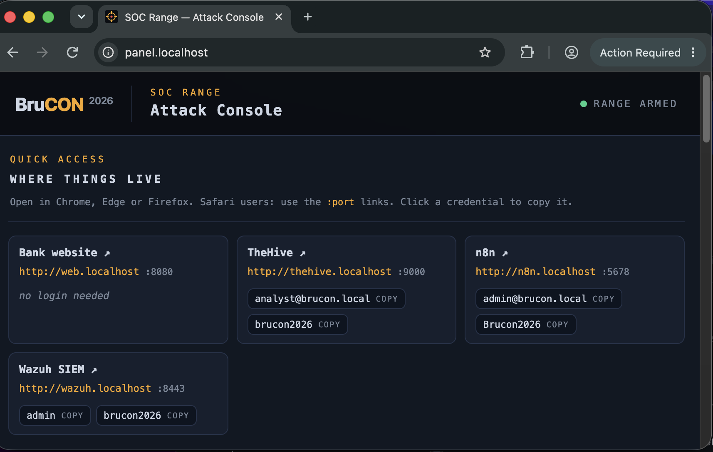
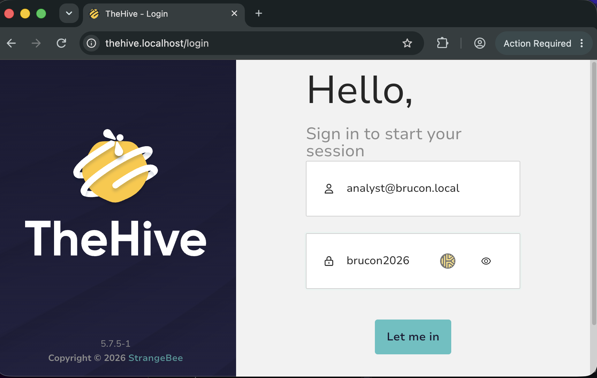
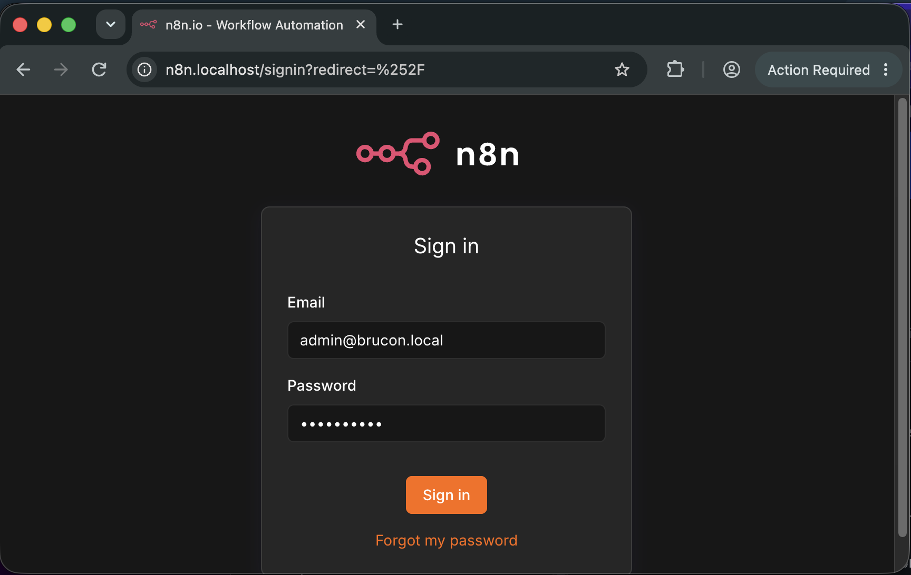

# Part 0: Connect

Your lab is a Docker compose stack on your own laptop: **TheHive**, **n8n**, **Wazuh**, the **Range control panel** and **bank-web**, the target that is vulnerable on purpose. This part starts it and proves it produces log data. *Module 1 needs the case Exercise 0.3 gives you.*

## Exercise #0.1: bring up the lab

**Goal**: every container is up and the start script has printed the service addresses.

The start script does the one-time setup, so there is nothing to configure by hand. It is safe to run again if you interrupt it.

1. **Get the workshop folder.** Clone the workshop repository, then enter it. Every later command that says "from the workshop folder" runs here.

   ```bash
   git clone https://github.com/bluecapone/soc-ai-assistant-workshop
   cd soc-ai-assistant-workshop
   ```

   No git? On the repository page, `Code`, `Download ZIP`, unzip it and open a terminal in the unzipped folder.
2. **Start Docker** and wait until it reports running. No Docker yet? Install Docker Desktop from [docs.docker.com/desktop](https://docs.docker.com/desktop/) first (it includes Docker Compose). Open Docker Desktop from the applications menu, or from a terminal:

   ```bash
   open -a Docker          # macOS
   sudo systemctl start docker   # Linux
   ```

   ```powershell
   Start-Process "C:\Program Files\Docker\Docker\Docker Desktop.exe"   # Windows
   ```

   Check with `docker info`; it errors until Docker is up. The start script checks this first and stops with `Docker is installed but the daemon isn't running` if you skip it.
3. **Run the start script.** From the workshop folder, on macOS or Linux:

   ```bash
   cd lab
   ./scripts/start.sh
   ```

   On Windows:

   ```powershell
   cd lab
   .\scripts\start.ps1
   ```

4. **Let it finish.** <ins>Do nothing else until it prints the Ready block.</ins> The first run builds three images and pulls the rest; a few minutes.

**Expected**: a `== Ready` block with five addresses and their logins, each with a `:port` alternative. If a `*.localhost` name does not open in your browser, use the port form.

Two containers show as *exited* in Docker Desktop: `wazuh-certs-generator` and `thehive-init`. Both are one-time setup jobs that finish before the services start. **Exit code 0 is normal.**

If Docker itself fails (Docker Desktop licensing, cgroup v1, WSL2 backend, corporate TLS interception), put your hand up. *Pair with a neighbour and use their lab; that is the fallback for the day.*

## Your range

The *range* is the chain one click travels. Every element below is a container on your laptop, and the panel's quick-access cards link to each one that has a web page.

- **Range control panel** (`http://panel.localhost`) is the attack console: ten attack buttons and six *benign twins*. A benign twin writes the same log shape as its attack but does no harm, so the SOC has to tell them apart. Every click runs a real command against bank-web after a confirm dialog and adds a row to the activity table.
- **bank-web** is the target: a bank site that is vulnerable on purpose. Its web access log and login log are the main log data; some buttons also write SSH, mail gateway, proxy or data-transfer log lines for the same host. *Nothing is seeded*; the logs fill only when a button is clicked.
- **Wazuh** (`http://wazuh.localhost`) is the SIEM. The manager reads those log files as new lines arrive, and turns lines into alerts:
  - a *decoder* splits each line into fields (`data.srcip`, `data.url`, `data.user_agent`);
  - a *rule* matches on those fields. A match is an *alert* with a rule id and a level from 0 to 15;
  - some rules count other rules: `100152` fires once per crawler request, and `100151` fires when it has seen twelve of those from one source inside a minute, so one click becomes *one* alert, not fifteen;
  - a noise generator writes rule `100200`, normal internet traffic against the bank site, directly into the alert index, thousands of them, so the SIEM looks real.
- **The integrator** is a script the Wazuh manager runs for every alert of a *forwarded* rule. It builds a case from the alert's fields and opens it in TheHive. Only a few rule ids are forwarded, so most of what Wazuh sees never becomes a case.
- **TheHive** (`http://thehive.localhost`) is case management. A *case* is the analyst's work item: a description, *observables* (the IPs, URLs and user agents taken from the alert) and tasks. Your verdicts land here.
- **n8n** (`http://n8n.localhost`) is workflow automation. A *workflow* is a chain of nodes on a canvas: a trigger node starts it (a webhook the integrator calls when it opens a case) and each next node does one thing with the data, such as calling a model or writing a verdict back to TheHive. Module 1 puts your AI triage in the middle of that chain.

The chain, in order:

1. panel click
2. bank-web log line
3. Wazuh alert
4. integrator
5. TheHive case
6. n8n workflow

Exercise 0.3 walks it once by hand.

## Exercise #0.2: sign in everywhere

**Goal**: the panel is your front door; from it you reach TheHive and n8n and sign in to both.

1. **Panel.** Open `http://panel.localhost`. No login. The quick-access cards at the top list every service with its login; *click a credential to copy it*. Below is the attack console: ten attack buttons and six benign twins in one list. Every click runs a real command against bank-web, after a confirm dialog.

   

2. **TheHive.** From its card, open `http://thehive.localhost`. Sign in as `analyst@brucon.local`, password `brucon2026`. *Ignore the licence warning* TheHive shows after login; the lab runs on the free tier and nothing in the workshop needs more.

   

3. **n8n.** From its card, open `http://n8n.localhost`. Sign in as `admin@brucon.local`, password `Brucon2026`. You see the workflow canvas with two nodes already built: a webhook trigger and a verdict writer.

   

**Expected**: TheHive shows an empty case list. The integrator has not fired yet, so *empty means success*.

**Question 1**: how many cases does TheHive list?

## Exercise #0.3: fire a benign button and follow it

**Goal**: one click on the panel becomes a Wazuh detection and then a TheHive case, and you watched it happen.

`Heavy crawler` is a *benign twin*: a real high-volume crawler reading the bank site from a harmless source address, with the same log shape as a scan. Nothing is seeded; this is the first real log data in the room.

1. **Fire.** On the panel, click `Heavy crawler` and confirm. The console prints the action and adds a row to the activity table.
2. **Sign in to Wazuh.** Open `http://wazuh.localhost` in another tab, user `admin`, password `brucon2026`. *Leave it open.*
3. **Find the case.** Go back to TheHive and refresh the case list. <ins>Wait up to one minute</ins>; the pipeline has three hops (log collector, rule engine, integrator script). Open the new case.
4. **Follow the link.** In the case description, find the `Wazuh alert` row of the table and click the alert id. Wazuh opens on the one detection your click produced. Expand the row and read:
   - `full_log`: the log line;
   - `rule.id` and `rule.description`: the rule that fired;
   - the `data.*` fields: the observables the decoder extracted.
5. **See the rest.** Now see everything Wazuh fired, not only the one it forwarded. In Wazuh, open the menu (top left), `Threat intelligence`, `Threat Hunting`, tab `Events`. Type `rule.id:100151` in the search bar to find your alert among the rest, then clear it and look at what is around it:
   - rule `100200` is *noise*: normal internet traffic against the bank site, thousands of events, generated on purpose;
   - rule `100152` is the single crawler hits that `100151` counted.

**Expected**: a case whose observables match the `data.*` fields of the Wazuh alert it links to.

**Question 2**: which rule id fired?

**Question 3**: what is the case id (the `~nnnnnn` in the case URL)?

*Module 1 needs this case.* If it never appears, pair with a neighbour and use their lab for Module 1.
