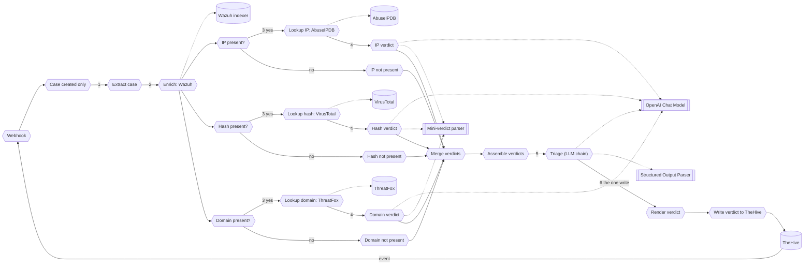

# Part 2: Module 2, run it unattended

You build an n8n workflow that triages a case the way you did by hand in Module 1, for every indicator the case carries, with nobody at the keyboard. TheHive posts every case event to a webhook. The workflow reads the case, looks up each indicator it finds (an IP, a hash, a domain, any or all of them), has one small model call judge each lookup on its own, then a bigger model call weighs all three judgments together and writes the one comment. The skeleton `SOC triage, build here (skeleton)` is already imported, inactive, by the start script. The texts you paste are in `exercises/module-2/`.

**The plan**

```text
Use case: triage one TheHive case with nobody at the keyboard
Trigger: TheHive posts every case event to the webhook; the workflow keeps case creation only
Steps:   1. take the case fields from the webhook body: an IP, a hash, a domain, whichever are present
         2. read the last 20 Wazuh events for the source IP
         3. look up each indicator that is present against its own reputation source
         4. judge each lookup in its own small model call
         5. weigh all three judgments together in one bigger model call
         6. post the verdict as one comment on the case
Result:  one comment with an indicator table plus three sections; nothing else changed anywhere
```



Success means: one click on the panel and nothing typed, one green execution in n8n, one comment with an indicator table and three sections on the case, and a changed sentence in a system message changes the verdict. Exercises 2.8 and 2.9 test that.

Each piece has a home:

| Module 1 | Module 2 | Job |
|---|---|---|
| `/soc-triage ~<case id>`, typed by you | `Webhook`, `Case created only` | starts one run per new case |
| `get_case.sh` | `Extract case` | the case fields, from the webhook body |
| `wazuh_events.sh` | `Enrich: Wazuh` | the last 20 events for the source IP |
| `reputation.sh` | `Lookup IP: AbuseIPDB`, `Lookup hash: VirusTotal`, `Lookup domain: ThreatFox` | one reputation source per indicator present |
| (no Module 1 equivalent) | `IP verdict`, `Hash verdict`, `Domain verdict` | one small model call judges each lookup alone |
| `SKILL.md` body | `Triage (LLM chain)`, system message | the rules, read once per case |
| `assets/verdict-template.md` | `Structured Output Parser`, `Render verdict` | indicator table plus three sections, four close states |
| `post_verdict.sh` | `Write verdict to TheHive` | the one write |

## Exercise #2.1: the trigger and the filter

The webhook fires on every case and alert event, and the workflow's own write is an update event that would fire it again, so the first node after the trigger keeps creation events only.

**Goal**: the skeleton is active and only case-creation events reach the rest of the workflow.

1. **Open the skeleton.** In n8n, open `SOC triage, build here (skeleton)`. Two nodes and a sticky note. Read the note (quote its first sentence in backticks: `Build between these two nodes`). Open `Write verdict to TheHive` and read what it expects: an item with `caseId` and `verdict`, credential `TheHive n8n`, `POST http://thehive.localhost/api/v1/case/{{ $json.caseId }}/comment`, the address Caddy aliases on the compose network, the same one you type in the browser.

2. **Activate it.** <ins>Only one workflow on the path `thehive-alert` can be active</ins>. Deactivate any other, then toggle this one on.

3. **Fire.** Panel, `Brute force`, confirm. In n8n, `Executions`: several rows for one click, one per TheHive event. Open one, click `Webhook`, read `body.objectType` and `body.operation`. The write node is red in every execution: it has no `caseId` yet. Expected, until Exercise 2.7.

4. **Add the filter.** Insert a `Filter` node between `Webhook` and `Write verdict to TheHive`, named `Case created only`. Two conditions, combinator AND, type string, operation equals. First, `{{ $json.body.objectType }}` equals `case`. Second, `{{ $json.body.operation }}` equals `Creation`. Fence the two expressions as `text`. Save, fire `Brute force` again.

**Expected**:

- [ ] One execution per TheHive event before the filter, all red at the write node.
- [ ] After the filter, the `Creation` event passes and any update event stops at `Case created only` (its output shows `0 items` kept).
- [ ] Node list:

  ```text
  Webhook
  -> Case created only
  -> Write verdict to TheHive
  ```

**Question 1**: the `body.operation` values you saw in the executions.

## Exercise #2.2: extract the ten fields

The integrator writes the answer into every case as a `kind:` tag and a `| Classification |` row, so two fields strip them. Three fields (source IP, hash, domain) are regexes over the description, and any of the three can come back empty: a case can carry none of them, one, two, or all three.

**Goal**: one Set node turns the webhook body into the ten fields every later node reads.

1. **Add the node.** `Edit Fields (Set)` after `Case created only`, named `Extract case`, mode `Manual Mapping`. Ten fields:

   ```text
   caseId (string):             {{ $json.body.object._id || $json.body.objectId || '' }}
   title (string):               {{ $json.body.object.title || 'unknown case' }}
   ruleId (string):              {{ ((($json.body.object.tags || []).find(t => String(t).startsWith('rule:'))) || 'rule:').slice(5) }}
   srcip (string):                {{ (String($json.body.object.description || '').match(/\| Source IP \| `([^`]+)` \|/) || [])[1] || '' }}
   host (string):                 {{ (String($json.body.object.description || '').match(/on host `([^`]+)`/) || [])[1] || '' }}
   target (string):                {{ (String($json.body.object.description || '').match(/\| Target \| `([^`]+)` \|/) || [])[1] || '' }}
   domain (string):                 {{ (String($json.body.object.description || '').match(/host=([A-Za-z0-9.-]+\.[A-Za-z]{2,})/) || String($json.body.object.description || '').match(/https?:\/\/([A-Za-z0-9.-]+\.[A-Za-z]{2,})/) || [])[1] || '' }}
   tagsForModel (array):             {{ ($json.body.object.tags || []).filter(t => !String(t).startsWith('kind:')) }}
   descriptionForModel (string):      {{ String($json.body.object.description || '').split('\n').filter(l => !l.startsWith('| Classification |')).join('\n') }}
   hash (string):                      {{ (String($json.body.object.description || '').match(/has sha256 `([0-9a-f]{64})`/) || [])[1] || '' }}
   ```

   Every string expression ends in `|| ''`, so a missing row gives an empty string and every later node still runs. `domain` tries two patterns: a `host=` query parameter first, then a bare URL, so a description that has neither leaves `domain` empty too.

2. **Fire and read.** `Brute force` again. Open the execution, click `Extract case`, read the output. Compare with the case in TheHive: `srcip` is the `Source IP` row, `ruleId` is the `rule:` tag without its prefix, `hash` is the sha256 quoted in the description if one is there.

**Expected**:

- [ ] `caseId` starts with `~`.
- [ ] `srcip` equals the `Source IP` row of the case.
- [ ] `tagsForModel` has no `kind:` entry and `descriptionForModel` has no `| Classification |` line.
- [ ] `hash` and `domain` are empty strings, not `undefined`, when the case carries neither.
- [ ] Node list adds `Extract case` between the filter and the write.

**Question 2**: `srcip` for your case.

## Exercise #2.3: the Wazuh lookup

One lookup answers for every indicator branch downstream: the same 20 events feed the gather chain later, regardless of which indicators the case carries.

**Goal**: one HTTP Request node returns what `wazuh_events.sh` returned, for the case's source IP.

1. **Add the node.** `HTTP Request` after `Extract case`, named `Enrich: Wazuh`. Method `POST`, URL `https://wazuh.indexer:9200/wazuh-alerts-*/_search`, Authentication `Generic Credential Type`, `Basic Auth`, credential `Wazuh indexer` (pre-provisioned, pick it from the list, type nothing). Send Body on, `JSON`:

   ```json
   { "size": 20, "_source": ["timestamp","rule.id","rule.level","rule.description","data.srcip","data.url","data.dstuser","agent.name"], "query": { "match": { "data.srcip": "{{ $json.srcip }}" } }, "sort": [ { "timestamp": "desc" } ] }
   ```

   Options, `Ignore SSL Issues` on (self-signed certificate).

2. **Fire and read.** `Brute force`. In the execution, `Enrich: Wazuh` output: `hits.total.value` and `hits.hits[0]._source.rule.id`.

3. **Only for testing, comparing output.** The same question, asked straight to the indexer:

   ```bash
   curl -sk -u admin:brucon2026 "$WAZUH_URL/wazuh-alerts-*/_search?q=data.srcip:35.235.240.58&sort=timestamp:desc&size=20" | jq '[.hits.total.value, .hits.hits[0]._source.rule.id]'
   ```

   `total` and the newest `rule.id` must match the node output.

**Expected**:

- [ ] `hits.total.value` above zero, newest first.
- [ ] The curl prints the same two values.
- [ ] Node list adds `Enrich: Wazuh` after `Extract case`.

**Question 3**: `hits.total.value` for your case.

## Exercise #2.4: judge each indicator on its own

An IF node per indicator decides whether there is anything to look up. When there is, one HTTP Request node calls that indicator's own reputation source. When there is not, a Set node records `not present` and skips the network call. Either way a small model call turns the raw reply into one judgment, using a schema and a model shared across all three indicators.

**Goal**: three parallel branches, one per indicator, each ending in a judgment of `malicious`, `clean`, `unknown`, or `not present`.

### Part A: the IP branch

1. **Add the gate.** `IF` after `Enrich: Wazuh`, named `IP present?`. One condition, string, `notEmpty`: `{{ $('Extract case').first().json.srcip }}`.

2. **Add the lookup.** `HTTP Request` on the `true` output, named `Lookup IP: AbuseIPDB`. `GET`, URL (expression) `https://api.abuseipdb.com/api/v2/check?ipAddress={{ $('Extract case').first().json.srcip }}&maxAgeInDays=90`. Send Headers on: `Key` = `{{ $env.ABUSEIPDB_API_KEY }}`, `Accept` = `application/json`. Settings: `On Error` = `Continue (using regular output)`, `Always Output Data` on. `ABUSEIPDB_API_KEY` is in `lab/.env`, separate from Module 1's own `OSINT_API_KEY`. Empty means the call fails and the chain below still runs.

3. **Add the skip.** `Edit Fields (Set)` on the `false` output, named `IP not present`. One field, `output` (object):

   ```text
   { indicator_type: 'ip', indicator: '', verdict: 'not present', evidence: 'field absent from the case' }
   ```

4. **Add the judge.** `Basic LLM Chain` after `Lookup IP: AbuseIPDB`, named `IP verdict`. Prompt `Define below`, text:

   ```text
   Indicator (ipv4): {{ $('Extract case').first().json.srcip }}

   AbuseIPDB reply:
   {{ JSON.stringify($json, null, 2) }}
   ```

   `Require Specific Output Format` on. System message: paste `exercises/module-2/ip-verdict-prompt.md`, include marker `<!-- file: exercises/module-2/ip-verdict-prompt.md -->` and a `markdown` fence.

   ```
   <!-- file: exercises/module-2/ip-verdict-prompt.md -->
   ```

5. **Add the shared model.** Click the chain's `Model` connector, `OpenAI Chat Model`. Credential `Model gateway`, model `By ID`, value `{{ $env.MODEL_WEAK }}`, temperature `0.2`.

6. **Add the shared parser.** Click the chain's `Output Parser` connector, `Structured Output Parser`, named `Mini-verdict parser`. Schema `Define below`, paste `exercises/module-2/mini-verdict-schema.json`.

### Part B: the hash branch, the same shape

7. **Repeat Steps 1-4** for the hash, the same four pieces:

   - Gate `Hash present?` on `{{ $('Extract case').first().json.hash }}`.
   - Lookup `Lookup hash: VirusTotal`, `GET` `https://www.virustotal.com/api/v3/files/{{ $('Extract case').first().json.hash }}`, header `x-apikey` = `{{ $env.VT_API_KEY }}`.
   - Skip `Hash not present`, `indicator_type: 'hash'`.
   - Judge `Hash verdict`, prompt paste `exercises/module-2/hash-verdict-prompt.md`, text:

   ```text
   Indicator (sha256): {{ $('Extract case').first().json.hash }}

   VirusTotal reply (projected to the deciding fields):
   {{ JSON.stringify({ stats: $json.data?.attributes?.last_analysis_stats, names: ($json.data?.attributes?.names || []).slice(0, 3), reputation: $json.data?.attributes?.reputation, error: $json.error }, null, 2) }}
   ```

   Reconnect `Hash verdict`'s `Model` and `Output Parser` connectors to the same `OpenAI Chat Model` and `Mini-verdict parser` you built in Part A. Do not build second copies.

### Part C: the domain branch, the same shape

8. **Repeat once more** for the domain, the same four pieces:

   - Gate `Domain present?` on `{{ $('Extract case').first().json.domain }}`.
   - Lookup `Lookup domain: ThreatFox`, `POST` `https://threatfox-api.abuse.ch/api/v1/`, header `Auth-Key` = `{{ $env.ABUSECH_AUTH_KEY }}`, JSON body `{{ JSON.stringify({ query: 'search_ioc', search_term: $('Extract case').first().json.domain, exact_match: true }) }}`.
   - Skip `Domain not present`, `indicator_type: 'domain'`.
   - Judge `Domain verdict`, prompt paste `exercises/module-2/domain-verdict-prompt.md`, text:

   ```text
   Indicator (domain): {{ $('Extract case').first().json.domain }}

   ThreatFox reply (projected to the deciding fields):
   {{ JSON.stringify({ query_status: $json.query_status, rows: (Array.isArray($json.data) ? $json.data : []).slice(0, 3).map(r => ({ ioc: r.ioc, threat_type: r.threat_type, malware: r.malware_printable, confidence: r.confidence_level })) }, null, 2) }}
   ```

   Same shared model, same shared parser again.

**Expected**:

- [ ] `Enrich: Wazuh` connects to all three gates: `IP present?`, `Hash present?`, `Domain present?`.
- [ ] Exactly one `OpenAI Chat Model` node feeds all three mini-chains (and, later, the gather chain too).
- [ ] Exactly one `Mini-verdict parser` node feeds all three mini-chains.
- [ ] Firing a case that carries an IP but no hash and no domain gives a judgment on `IP verdict` and `not present` from the other two branches, no red nodes.
- [ ] Node list:

  ```text
  Webhook
  -> Case created only
  -> Extract case
  -> Enrich: Wazuh
     -> IP present?
          true  -> Lookup IP: AbuseIPDB -> IP verdict
                       -> OpenAI Chat Model, Mini-verdict parser (shared)
          false -> IP not present
     -> Hash present?
          true  -> Lookup hash: VirusTotal -> Hash verdict
                       -> OpenAI Chat Model, Mini-verdict parser (shared)
          false -> Hash not present
     -> Domain present?
          true  -> Lookup domain: ThreatFox -> Domain verdict
                       -> OpenAI Chat Model, Mini-verdict parser (shared)
          false -> Domain not present
  -> Write verdict to TheHive
  ```

**Question 4**: the three judgments (`malicious`, `clean`, `unknown`, or `not present`) your case's three branches returned.

## Exercise #2.5: merge and assemble

Three branches produce three items, one per input, not necessarily in the same order the case arrived. One Merge node lines them up. One Code node turns them into the single document the big chain reads.

**Goal**: one item that carries the case, its Wazuh events, and all three indicator judgments together.

1. **Add the merge.** `Merge` node, named `Merge verdicts`. Mode `Append`, `Number of Inputs` `3`. Wire three inputs:

   - Input 1 from `IP verdict` and `IP not present`.
   - Input 2 from `Hash verdict` and `Hash not present`.
   - Input 3 from `Domain verdict` and `Domain not present`.

2. **Add the assembly.** `Code` node after `Merge verdicts`, named `Assemble verdicts`, JavaScript:

   ```javascript
   // One item out: the case, its Wazuh events, and the three indicator verdicts.
   const c = $('Extract case').first().json;
   const wz = ((($('Enrich: Wazuh').first().json || {}).hits || {}).hits || []).map(h => h._source);
   const verdicts = $input.all().map(i => i.json.output).filter(Boolean);
   return [{ json: {
     caseId: c.caseId,
     case: { title: c.title, ruleId: c.ruleId, srcip: c.srcip, host: c.host, target: c.target, domain: c.domain, hash: c.hash, tags: c.tagsForModel, description: c.descriptionForModel },
     wazuhEvents: wz,
     indicatorVerdicts: verdicts,
   } }];
   ```

3. **Fire and read.** `Brute force`. `Assemble verdicts` output: one item, `indicatorVerdicts` an array of exactly three objects.

**Expected**:

- [ ] `Merge verdicts` shows three inputs wired, one output.
- [ ] `Assemble verdicts` output has exactly one item, and `indicatorVerdicts.length` is `3` regardless of how many indicators the case carried.
- [ ] Node list adds `Merge verdicts -> Assemble verdicts` after the three branches.

**Question 5**: `indicatorVerdicts.length` on `Assemble verdicts`' output (it is always 3, so answer with why).

## Exercise #2.6: the gather chain and the contract

The Basic LLM Chain calls the model once with the case, its Wazuh events, and all three indicator judgments already gathered. It weighs the judgments against each other and against the raw Wazuh events. It does not call a tool and does not loop.

**Goal**: the gather chain holds the Module 1 rules as its system message, the same shared model behind the gateway, and a parser that refuses anything but the three fields.

1. **Add the chain.** `Basic LLM Chain` after `Assemble verdicts`, named `Triage (LLM chain)`. Prompt `Define below`, text `{{ JSON.stringify($json, null, 2) }}`. `Require Specific Output Format` on. System message: paste the whole of `exercises/module-2/system-prompt.md`.

   ```
   <!-- file: exercises/module-2/system-prompt.md -->
   ```

   The paste file has five sections:

   - The Task names the JSON document by shape: case, Wazuh events, indicator verdicts, one document.
   - `How to judge` is the same six rules Module 1 wrote by hand.
   - `Indicator verdicts` tells the model to restate each of the three judgments in the summary and never contradict one silently.
   - `Verdict contract` names the three fields the workflow renders as headings.
   - `Guardrails` repeats the same four rules as Module 1's skill.

   The closing `This module` section says the workshop does not ask this workflow for a real determination yet. It always suggests `other` and explains what evidence a determination would need.

2. **Reconnect the model.** `Triage (LLM chain)`'s `Model` connector: the same `OpenAI Chat Model` node from Exercise 2.4. Do not add a second model node.

3. **Add the parser.** Click the chain's `Output Parser` connector, `Structured Output Parser`. Schema `Define below`, paste `exercises/module-2/output-schema.json`.

**Expected**:

- [ ] The chain shows two sub-connections: the shared model and its own `Structured Output Parser` (not the `Mini-verdict parser`).
- [ ] `grep MODEL_WEAK lab/.env` prints a model id, not an empty value.
- [ ] Node list adds `Triage (LLM chain)` after `Assemble verdicts`, with `OpenAI Chat Model` (shared) and `Structured Output Parser` as its sub-nodes.

**Question 6**: the model id `MODEL_WEAK` holds.

## Exercise #2.7: render and write

The model returns three fields. The workflow prepends a fourth section it builds itself, an indicator table, before those three, so the analyst sees every judgment the case carried, not only the model's summary of them.

**Goal**: one comment, four sections, posted to the case that started the run.

1. **Render it.** `Edit Fields (Set)` after the chain, named `Render verdict`, two fields. `caseId (string)` = `{{ $('Assemble verdicts').first().json.caseId }}`. `verdict (string)`:

   ```text
   ### Indicator verdicts
   | Type | Indicator | Verdict | Evidence |
   |---|---|---|---|
   {{ $('Assemble verdicts').first().json.indicatorVerdicts.map(v => '| ' + v.indicator_type + ' | `' + (v.indicator || 'n/a') + '` | **' + v.verdict + '** | ' + String(v.evidence || '').replace(/\|/g, '/') + ' |').join('\n') }}

   ### Summary
   {{ $json.output.summary }}

   ### Suggested close state
   {{ $json.output.suggested_close_state }}

   ### Recommended actions
   {{ $json.output.recommended_actions }}

   Written by the Module 2 workflow (chain per indicator, model {{ $env.MODEL_WEAK }}).
   ```

2. **Wire the write.** Connect `Render verdict` to `Write verdict to TheHive`. Save.

**Expected**:

- [ ] The rendered table has one row per indicator, even the `not present` ones.
- [ ] Node list, complete:

  ```text
  Webhook
  -> Case created only
  -> Extract case
  -> Enrich: Wazuh
     -> IP present? -> (Lookup IP: AbuseIPDB -> IP verdict) | IP not present
     -> Hash present? -> (Lookup hash: VirusTotal -> Hash verdict) | Hash not present
     -> Domain present? -> (Lookup domain: ThreatFox -> Domain verdict) | Domain not present
  -> Merge verdicts
  -> Assemble verdicts
  -> Triage (LLM chain)
  -> Render verdict
  -> Write verdict to TheHive
  ```

No question. Exercise 2.8 tests the whole chain end to end.

## Exercise #2.8: fire it and walk away

**Goal**: one click on the panel ends as a four-section comment on the case, with no red node and nothing typed.

1. **Activate.** Save, toggle `Active`. Only one workflow on `thehive-alert`.

2. **Fire.** `Brute force`, confirm, hands off the keyboard.

3. **Watch.** `Executions`: one green row for the `Creation` event. Open it and read each node's output in wire order.

4. **Read it in TheHive.** Open the case. From the API, the comments curl from Part 1 (`03-module-1.md`, Exercise 1.5, Part B).

**Expected**:

- [ ] One green execution, every node ran.
- [ ] The comment has an indicator table and three `###` sections, and ends with `Written by the Module 2 workflow`.
- [ ] The table names the source IP `Enrich: Wazuh` returned events for, and any hash or domain the case carried.
- [ ] The close state is `other`: this module only suggests, it never determines.

Failure hint: a red `Triage (LLM chain)` with a parser error means the model did not return the three fields. A red mini-chain means the same for one indicator. Read the error text, then go to Exercise 2.9, because the fix is a sentence.

**Question 7**: the case id. **Question 8**: one phrase from the summary that ties an indicator judgment to what `Enrich: Wazuh` returned.

## Exercise #2.9: fix the text

**Goal**: one changed sentence in a system message changes the verdict on the twin.

1. **Fire the twin.** `Admin login` on the panel (the twin of `Brute force`: a real admin mistypes, then succeeds). Read its verdict in TheHive.

2. **Find the weakest line.** The line of the verdict that does not match what `Enrich: Wazuh` returned. Trace it to a rule in `How to judge`, in `exercises/module-2/system-prompt.md`.

3. **Change the twin rule.** In `Triage (LLM chain)`'s system message, edit rule 2 so it no longer mentions failures before the success. Save. Fire `Admin login` again (a new case: the webhook is the only trigger, so a rerun is a new click). Compare the two verdicts.

4. **Restore it** and fire once more.

5. **Keep the cases open.** Your Module 1 case and these. The end of the day puts them side by side.

**Expected**:

- [ ] With the rule as shipped, the summary mentions the failed attempts before the success.
- [ ] With the rule weakened, the summary drops that mention, or reads the run as a plain admin login.
- [ ] Both runs keep `suggested_close_state` at `other`: this module never makes the determination itself, only Module 3 does.
- [ ] Each fix was one sentence, one save, one click.

**Question 9**: the sentence you changed, and the summary phrase that disappeared when you weakened it.

## Stuck five minutes?

The checkpoint `SOC triage, Module 2 checkpoint (LLM chain)` is imported and inactive. Deactivate whatever is active on `thehive-alert`, activate it, fire an alert, and resume from Exercise 2.8.
