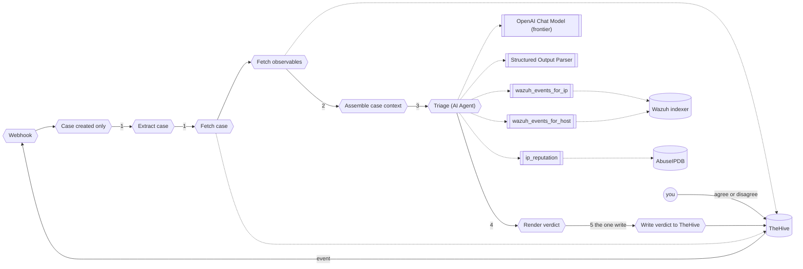

# Part 3: Module 3, let it decide

You duplicate your Module 2 workflow, cut out everything that decided things for the model, and replace it with an agent that reads the whole case, chooses which lookups to run, and still writes one comment. Then you decide what happens to the case. The two texts you paste are in `exercises/module-3/`.

**The plan**

```text
Use case: triage one TheHive case, the agent choosing what to look up
Trigger: the same webhook and filter as Module 2
Steps:   1. read the case and its observables from TheHive
         2. hand the whole case to the agent
         3. the agent calls the lookups it needs, up to 10 turns
         4. it judges, and states its determination in one line
         5. post the verdict, then you agree or disagree on the case
Result:  one comment with four sections, nothing else changed anywhere, nothing happens to the case until you decide
```



Success means: the execution trace shows at least one lookup the agent chose to run, the comment carries a `Determination` line and the same three sections Module 2 wrote, and the case is unchanged until you write your decision on it. Exercises 3.5 and 3.6 test that.

Each piece has a home:

| Module 2 | Module 3 | What changed |
|---|---|---|
| the whole chain-per-indicator build: branches, lookups, mini chains, the merge | `wazuh_events_for_ip`, `wazuh_events_for_host`, `ip_reputation` | tools, run only when the agent asks |
| `Extract case` alone | `Extract case`, `Fetch case`, `Fetch observables` | the whole case, observables included |
| built by the workflow before the model ever runs | `Assemble case context` | case plus observables, no pre-run lookups |
| `Triage (LLM chain)`, `OpenAI Chat Model` | `Triage (AI Agent)`, `OpenAI Chat Model (frontier)` | loops, at most 10 turns, frontier model |
| three fields | four fields, `determination` first | one line saying malicious, benign, or undetermined |
| you read the verdict | you agree or disagree on the case | the gate |

## Exercise #3.1: duplicate it, then cut it down to size

Module 2's branches, lookups, and mini judges do not carry over. The agent decides what to look up for itself, so nothing that decided things ahead of the model survives. What survives is the shape at the edges: the trigger and the write.

**Goal**: a copy of your Module 2 workflow, pruned back to four nodes, ready for an agent in the middle.

1. **Duplicate.** In n8n, open your Module 2 workflow, menu, `Duplicate`, name it `SOC triage, Module 3 (AI Agent)`. Deactivate the Module 2 one.

2. **Cut the machinery.** Delete every node between `Extract case` and `Write verdict to TheHive`. That is `Enrich: Wazuh`, the three `present?` gates, the three lookups, the three `not present` sets, the three mini verdict chains with their shared model and parser, `Merge verdicts`, `Assemble verdicts`, `Triage (LLM chain)`, and `Render verdict`. What is left: `Webhook -> Case created only -> Extract case -> Write verdict to TheHive`.

3. **Add the agent.** `AI Agent` between `Extract case` and `Write verdict to TheHive`, named `Triage (AI Agent)`. Prompt `Define below`, text:

   ```text
   {{ JSON.stringify($json, null, 2) }}
   ```

   `Require Specific Output Format` on. Options: `Max Iterations` `10`, `Return Intermediate Steps` on.

4. **Add the parser.** `Structured Output Parser` on the agent's `Output Parser` connector. Schema `Define below`, paste `exercises/module-3/output-schema.json`.

5. **Add the model.** `OpenAI Chat Model` on the agent's `Model` connector, rename it `OpenAI Chat Model (frontier)`, credential `Model gateway`, model `By ID` `{{ $env.MODEL_FRONTIER }}`, temperature `0.2`. `MODEL_FRONTIER` is in `lab/.env`, announced from the slide on the day.

**Expected**:

- [ ] The agent shows its `Memory` connector empty (on purpose, each case is one run) and its `Tool` connector empty (Exercise 3.3 fills it).
- [ ] `grep MODEL_FRONTIER lab/.env` prints a model id.
- [ ] Node list:

  ```text
  Webhook
  -> Case created only
  -> Extract case
  -> Triage (AI Agent)
       -> OpenAI Chat Model (frontier)
       -> Structured Output Parser
  -> Write verdict to TheHive
  ```

**Question 1**: the model id `MODEL_FRONTIER` holds.

## Exercise #3.2: feed it the whole case

Module 2 gave the model whichever indicators it found, each one already looked up. The agent gets the case as TheHive holds it, observables included, and nothing pre-run.

**Goal**: the agent's input is the case record and its observables, read from TheHive, and nothing else.

1. **Fetch the case.** `HTTP Request` after `Extract case`, named `Fetch case`. `GET`, URL (expression) `http://thehive:9000/api/v1/case/{{ $json.caseId }}`, Authentication `Generic Credential Type`, `Header Auth`, credential `TheHive n8n`.

2. **Fetch the observables.** `HTTP Request` after it, named `Fetch observables`. `POST`, URL `http://thehive:9000/api/v1/query`, same auth, Send Body `JSON`, body (expression):

   ```text
   {{ JSON.stringify({ query: [ { _name: 'getCase', idOrName: $('Extract case').first().json.caseId }, { _name: 'observables' } ] }) }}
   ```

   Settings: `On Error` = `Continue (using regular output)`, `Always Output Data` on. A case without observables must not stop the run.

3. **Assemble the case.** `Edit Fields (Set)` after `Fetch observables`, named `Assemble case context`, three fields:

   ```text
   caseId (string):     {{ $('Extract case').first().json.caseId }}
   case (object):        {{ { title: $('Extract case').first().json.title, ruleId: $('Extract case').first().json.ruleId, srcip: $('Extract case').first().json.srcip, host: $('Extract case').first().json.host, target: $('Extract case').first().json.target, domain: $('Extract case').first().json.domain, tags: $('Extract case').first().json.tagsForModel, description: $('Extract case').first().json.descriptionForModel, severity: $('Fetch case').first().json.severity, status: $('Fetch case').first().json.status, createdAt: $('Fetch case').first().json._createdAt } }}
   observables (array):  {{ $('Fetch observables').all().map(i => i.json).filter(o => o && o.dataType).map(o => ({ dataType: o.dataType, data: o.data, message: o.message, ioc: o.ioc })) }}
   ```

   `case` now also carries `severity`, `status`, and `createdAt` from `Fetch case`.

4. **Rewire.** `Extract case -> Fetch case -> Fetch observables -> Assemble case context -> Triage (AI Agent)`.

5. **Fire and read.** `Brute force`. `Assemble case context` output.

6. **Only for testing, comparing output.** The case, and the observables query, asked straight to TheHive:

   ```bash
   curl -s -H "Authorization: Bearer $THEHIVE_APIKEY" "$THEHIVE_URL/api/v1/case/~<case id>" | jq '.title, .status'
   curl -s -X POST "$THEHIVE_URL/api/v1/query" -H "Authorization: Bearer $THEHIVE_APIKEY" -H "Content-Type: application/json" -d '{"query":[{"_name":"getCase","idOrName":"~<case id>"},{"_name":"observables"}]}' | jq '.[].dataType'
   ```

**Expected**:

- [ ] `case.severity`, `case.status`, and `case.createdAt` are filled.
- [ ] `observables` lists the case's observables with `dataType` and `data`.
- [ ] `case.tags` has no `kind:` entry.
- [ ] Node list:

  ```text
  Webhook
  -> Case created only
  -> Extract case
  -> Fetch case
  -> Fetch observables
  -> Assemble case context
  -> Triage (AI Agent)
       -> OpenAI Chat Model (frontier)
       -> Structured Output Parser
  -> Write verdict to TheHive
  ```

**Question 2**: how many observables the case has.

## Exercise #3.3: the lookups as tools

Module 2's lookups ran every time, in order, whether or not the model needed them. Here each lookup is a tool with a description the agent reads to decide whether to call it, and `$fromAI(...)` marks the argument the model fills in.

**Goal**: three tools on the agent, each with the sentence the agent reads to decide.

1. **Wazuh by IP.** On the agent's `Tool` connector, `HTTP Request Tool`, named `wazuh_events_for_ip`. Description:

   ```text
   Return the 20 most recent Wazuh alerts whose source IP equals the given ip. Use it to see what else this address did before and after the event.
   ```

   `POST` `https://wazuh.indexer:9200/wazuh-alerts-*/_search`, `Basic Auth`, credential `Wazuh indexer`, body `JSON`:

   ```json
   { "size": 20, "_source": ["timestamp","rule.id","rule.level","rule.description","data.srcip","data.url","data.dstuser","agent.name"], "query": { "match": { "data.srcip": "{{ $fromAI('ip', 'IPv4 address of the source to look up', 'string') }}" } }, "sort": [ { "timestamp": "desc" } ] }
   ```

   `Ignore SSL Issues` on.

2. **Wazuh by host.** `wazuh_events_for_host`, description `Return the 20 most recent Wazuh alerts on the given host (the Wazuh agent name).`, same URL and auth, body with `agent.name` and `{{ $fromAI('host', 'Wazuh agent name of the host', 'string') }}`.

3. **Reputation.** `ip_reputation`, description:

   ```text
   Look up an IP on AbuseIPDB. Returns abuseConfidenceScore (0 to 100, 50 and above is flagged) and totalReports. Returns an error when no key is configured; then say reputation is unavailable.
   ```

   `GET`, URL (expression) `https://api.abuseipdb.com/api/v2/check?ipAddress={{ $fromAI('ip', 'IPv4 address to look up', 'string') }}&maxAgeInDays=90`, headers `Key` = `{{ $env.ABUSEIPDB_API_KEY }}`, `Accept` = `application/json`.

**Expected**:

- [ ] The agent's `Tool` connector shows three tools.
- [ ] Node list adds three indented tool lines under `Triage (AI Agent)`.

No question.

## Exercise #3.4: the prompt and the schema

Three modules, one output shape. The agent's message adds permission to investigate and the duty to decide, and the parser gains one field.

**Goal**: the agent is told it may look things up and must decide, and the parser holds four fields.

1. **Replace the system message.** Agent, Options, `System Message`, paste the whole of `exercises/module-3/system-prompt.md`.

   ```
   <!-- file: exercises/module-3/system-prompt.md -->
   ```

   The paste file is Module 2's Task, `How to judge`, and `Guardrails` unchanged. Its closing section, `This module`, names the three tools, says when to call each, and defines the `determination` line: `Malicious.`, `Benign.`, or `Undetermined.`, followed by the reason.

2. **Confirm the schema.** `Structured Output Parser`'s schema, from Exercise 3.1, already matches `exercises/module-3/output-schema.json`: four required fields, `determination` first.

3. **Render the fourth section.** `Render verdict` after the agent, `caseId (string)` = `{{ $('Assemble case context').first().json.caseId }}`, `verdict (string)`:

   ```text
   ### Determination
   {{ $json.output.determination }}

   ### Summary
   {{ $json.output.summary }}

   ### Suggested close state
   {{ $json.output.suggested_close_state }}

   ### Recommended actions
   {{ $json.output.recommended_actions }}

   Written by the Module 3 workflow (AI Agent, model {{ $env.MODEL_FRONTIER }}, tool calls: {{ ($json.intermediateSteps || []).length }}).
   ```

   Wire `Render verdict` to `Write verdict to TheHive`.

**Expected**:

- [ ] The parser's schema lists four required fields.
- [ ] The render expression has four `###` headings.

No question.

## Exercise #3.5: fire it and read the trace

**Goal**: one run where the agent chose its own lookups, and you can name them in order.

1. **Activate.** Only one workflow on `thehive-alert`.

2. **Fire.** `Brute force`.

3. **Read the trace.** Execution, `Triage (AI Agent)`. The intermediate steps list each tool call with the arguments the model filled (`ip`, `host`) and what came back. Which tools, in which order, which it skipped.

4. **Read it in TheHive.** Four sections. The trailer says `tool calls: N`. Comments curl as Exercise 2.8.

**Expected**:

- [ ] At least one tool call in the trace.
- [ ] `Determination` starts with `Malicious.`, `Benign.`, or `Undetermined.`.
- [ ] The close state is one of the four.
- [ ] The trailer's `tool calls` equals the trace count.

Failure hint: a verdict with `tool calls: 0` and no error means the model never saw the tools. Check the three are attached to the agent's `Tool` connector, and that `MODEL_FRONTIER` is the frontier id, because the weak tier ignores tools.

**Question 3**: the tools the agent called, in order. **Question 4**: the close state.

## Exercise #3.6: you are the gate

The agent has one credential, `TheHive n8n`, and the only call that writes is the comment. It cannot close the case, block an address, or touch the range. That is a permission and a credential, not a smarter model.

A gate needs three things:

1. The reviewer must have the authority to overrule the machine.
2. The surface must show the evidence the agent recommended from.
3. Agree and disagree must be equally easy, and neither one the default.

**Then, keep it open.** Your Module 1, Module 2, and Module 3 cases, side by side. Same alert, same contract, three different workers.

**Goal**: your decision, with a reason, is on the case, and nothing else about the case changed.

1. **Read as the reviewer.** Open the case. Read the four sections against the trace.

2. **Decide.** Add a comment to the case: `Agree` or `Disagree`, then one sentence why.

3. **Check nothing moved.** The case status is still `Open`. Two comments: the workflow's and yours.

   ```bash
   curl -s -H "Authorization: Bearer $THEHIVE_APIKEY" "$THEHIVE_URL/api/v1/case/~<case id>" | jq '{status, tags}'
   ```

**Expected**:

- [ ] `status` is `Open`.
- [ ] The comments query returns two comments.
- [ ] Three cases open, one per module, same alert.

**Question 5**: your decision, and the case id it is on.

## Stuck five minutes?

The checkpoint `SOC triage, Module 3 checkpoint (AI Agent)` is imported and inactive. Deactivate whatever is active on `thehive-alert`, activate it, fire an alert, and resume from Exercise 3.5. The checkpoint also carries a `Canary?` branch that skips the model for rule `100150`. It is not part of the exercises.
