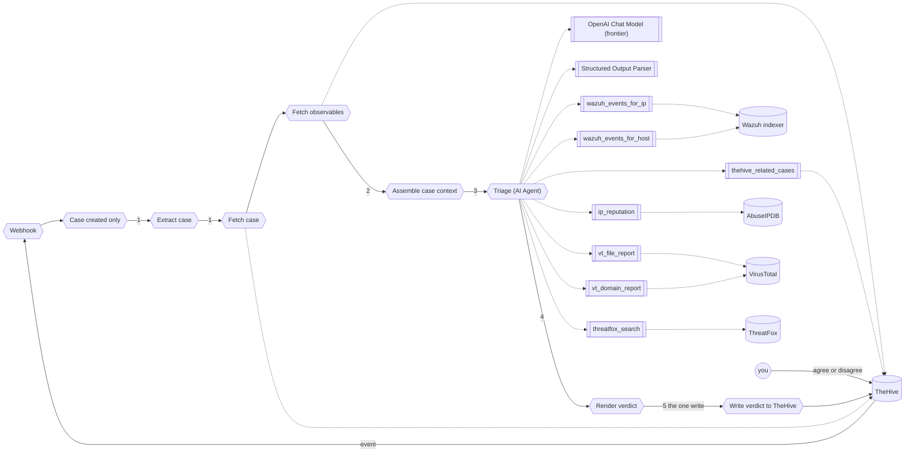

# Module 3: let it decide

You open the Module 3 skeleton, which already has the webhook, the filter, the case fetches, and the agent in place. The three wired tools show the pattern. You add four more tools and activate the workflow.

The agent reads the whole case, chooses which lookups to run, and judges. Then you decide what happens to the case. The two texts you paste are in `exercises/module-3/`.

**The plan**

```text
Trigger: the same webhook and filter as Module 2
Steps:   1. read the case and its observables from TheHive
         2. hand the whole case to the agent
         3. the agent calls the lookups it needs, up to 10 turns
         4. it judges, and states its determination in one line
         5. post the verdict, then you agree or disagree on the case
```



Success means: the execution trace shows at least one lookup the agent chose to run, the comment carries a `Determination` line and the same three sections Module 2 wrote, and the case is unchanged until you write your decision on it. Exercises 3.5 and 3.6 test that.

Each piece has a home:

| Module 2 | Module 3 | What changed |
|---|---|---|
| the whole chain-per-indicator build: branches, lookups, mini chains, the merge | three tools wired, four to add | tools, run only when the agent asks |
| `Extract case` alone | `Extract case`, `Fetch case`, `Fetch observables` | the whole case, observables included |
| built by the workflow before the model ever runs | `Assemble case context` | case plus observables, no pre-run lookups |
| `Triage (LLM chain)`, `OpenAI Chat Model` | `Triage (AI Agent)`, `OpenAI Chat Model (frontier)` | loops, at most 10 turns, frontier model |
| three fields | four fields, `determination` first | one line saying malicious, benign, or undetermined |
| you read the verdict | you agree or disagree on the case | the gate |

## Exercise #3.1: open the Module 3 skeleton

The skeleton already has the foundation: webhook, filter, case reads, the agent, the parser, and three of seven tools wired. You see what is there, confirm it is ready, and move on to understanding the tool pattern.

**Goal**: the skeleton is open, active on the webhook path, and you can name the three wired tools.

1. **Open the skeleton.** In n8n, open `SOC triage, Module 3 skeleton (AI Agent)`. Fourteen nodes, the three wired tools among them. Count the tools on the agent's `Tool` connector, then read the system prompt's tool list and see how many it names.

2. **Read the model and the agent.** `Triage (AI Agent)`: the `Memory` connector is empty, on purpose, because each case is one run. The `Tool` connector shows three of the seven tools the system prompt names. Confirm `OpenAI Chat Model (frontier)` sits on the agent's `Model` connector and that its model is `{{ $env.MODEL_FRONTIER }}`. The frontier tier is not a luxury here: the weak tier ignores tools, so an agent on it returns a verdict having looked nothing up.

3. **Activate it.** Only one workflow on `thehive-alert`. Deactivate any other, then toggle this one on.

4. **Fire and see.** `Brute force`, confirm. In n8n, `Executions`: one green row for the `create` event. Open it and check that every node ran and the `Render verdict` output has four `###` headings.

**Expected**:

- [ ] The system prompt names seven tools, and only three are wired.
- [ ] Three tools are wired to the agent: name them.
- [ ] The agent's `Memory` connector is empty.
- [ ] `grep MODEL_FRONTIER lab/.env` prints a model id.
- [ ] Node list:

  ```text
  Webhook
  -> Case created only
  -> Extract case
  -> Fetch case
  -> Fetch observables
  -> Assemble case context
  -> Triage (AI Agent)
       -> OpenAI Chat Model (frontier)
       -> Structured Output Parser
       -> wazuh_events_for_ip
       -> wazuh_events_for_host
       -> thehive_related_cases
  -> Render verdict
  -> Write verdict to TheHive
  ```

**Question 1**: the model id `MODEL_FRONTIER` holds.

## Exercise #3.2: what the agent is given

The skeleton fetches the case and its observables from TheHive, and assembles them into one item. Nothing is pre-run. The agent reads the whole case, its history, what tried to reach it, and decides what else to look up.

**Goal**: the agent's input is the case record and its observables, read from TheHive, and nothing else.

1. **Read the three input nodes.** `Fetch case`, `Fetch observables`, `Assemble case context` are already wired and working. Open each and read what it does. The case record from TheHive with `severity`, `status`, `createdAt`. Its observables. A Set node that hands both to the agent.

2. **Fire and read.** `Brute force`. Open the execution. Click `Assemble case context` and read the output.

3. **Only for testing, comparing output.** The case and the observables, asked straight to TheHive:

   ```bash
   curl -s -H "Authorization: Bearer $THEHIVE_APIKEY" "$THEHIVE_URL/api/v1/case/~<case id>" | jq '.title, .severity'
   curl -s -X POST "$THEHIVE_URL/api/v1/query" -H "Authorization: Bearer $THEHIVE_APIKEY" -H "Content-Type: application/json" -d '{"query":[{"_name":"getCase","idOrName":"~<case id>"},{"_name":"observables"}]}' | jq '.[].dataType'
   ```

**Expected**:

- [ ] `case.severity`, `case.status`, and `case.createdAt` are filled.
- [ ] `observables` lists the case's observables with `dataType` and `data`.
- [ ] `case.tags` has no `kind:` entry.
- [ ] The curl output matches the node output.

**Question 2**: how many observables the case has.

## Exercise #3.3: read the three wired tools

Each tool has a description the agent reads to decide whether to call it, and `$fromAI(...)` marks the argument the model fills. The three wired tools show the pattern. Read them, understand what they answer, and you will add four more the same way.

**Goal**: you understand the tool pattern and can name what each of the three wired tools answers.

1. **Wazuh by IP.** `wazuh_events_for_ip` on the agent's `Tool` connector. Read its description and its `$fromAI` argument. What does it return?

2. **Wazuh by host.** `wazuh_events_for_host`. Same questions.

3. **TheHive, related cases.** `thehive_related_cases`. Read its description and see what it queries TheHive for.

**Expected**:

- [ ] Three tools are attached to the agent's `Tool` connector.
- [ ] Each tool has a `toolDescription` that tells the agent why to call it.

**Question 3**: the three tools' names.

## Exercise #3.4: add the four missing tools

The system prompt names seven tools. Three are wired. Add the four others as `HTTP Request Tool` nodes on the agent's `Tool` connector. Copy the descriptions and the `$fromAI(...)` placeholders verbatim from the fact sheet.

**Goal**: seven tools on the agent, each describing what the agent needs to know to decide whether to call it.

The four, at a glance. Each is an `HTTP Request Tool` on the agent's `Tool` connector, and each needs its key in `lab/.env`.

| Tool | Method | Source | Header |
|---|---|---|---|
| `ip_reputation` | GET | AbuseIPDB | `Key: {{ $env.ABUSEIPDB_API_KEY }}` |
| `vt_file_report` | GET | VirusTotal | `x-apikey: {{ $env.VT_API_KEY }}` |
| `vt_domain_report` | GET | VirusTotal | `x-apikey: {{ $env.VT_API_KEY }}` |
| `threatfox_search` | POST | ThreatFox | `Auth-Key: {{ $env.ABUSECH_AUTH_KEY }}` |

The first three also send `Accept` = `application/json`. The descriptions and URLs below are pasted verbatim, so they stay in code blocks rather than in the table.

1. **IP reputation.** `HTTP Request Tool`, named `ip_reputation`. Description, URL, headers, body verbatim:

   Description:

   ```text
   Look up an IP on AbuseIPDB. Returns abuseConfidenceScore (0 to 100, 50 and above is flagged) and totalReports. Returns an error when no key is configured. Then say reputation is unavailable.
   ```

   `GET`, URL (expression):

   ```text
   https://api.abuseipdb.com/api/v2/check?ipAddress={{ $fromAI('ip', 'IPv4 address to look up', 'string') }}&maxAgeInDays=90
   ```

   Headers: `Key` = `{{ $env.ABUSEIPDB_API_KEY }}`, `Accept` = `application/json`.

2. **VirusTotal, file hash.** `vt_file_report`. Description:

   ```text
   Look up a file hash (md5, sha1 or sha256) on VirusTotal. Detection counts are under data.attributes.last_analysis_stats (malicious, suspicious, harmless, undetected). Returns an error when no key is configured. Then say the hash reputation is unavailable.
   ```

   `GET`, URL (expression):

   ```text
   https://www.virustotal.com/api/v3/files/{{ $fromAI('hash', 'File hash (md5, sha1 or sha256) to look up', 'string') }}
   ```

   Headers: `x-apikey` = `{{ $env.VT_API_KEY }}`, `Accept` = `application/json`.

3. **VirusTotal, domain.** `vt_domain_report`. Description:

   ```text
   Look up a domain on VirusTotal. Detection counts are under data.attributes.last_analysis_stats. Take the host out of a URL first. Returns an error when no key is configured. Then say the domain reputation is unavailable.
   ```

   `GET`, URL (expression):

   ```text
   https://www.virustotal.com/api/v3/domains/{{ $fromAI('domain', 'Domain name to look up (host only, no scheme or path)', 'string') }}
   ```

   Headers: `x-apikey` = `{{ $env.VT_API_KEY }}`, `Accept` = `application/json`.

4. **ThreatFox.** `threatfox_search`. Description:

   ```text
   Search abuse.ch ThreatFox for an indicator (IP, domain, URL or file hash). Returns matching malware or botnet C2 records with a confidence level, or query_status no_result when the indicator is not known to ThreatFox. Returns an error when no key is configured. Then say ThreatFox is unavailable.
   ```

   `POST` `https://threatfox-api.abuse.ch/api/v1/`, header `Auth-Key` = `{{ $env.ABUSECH_AUTH_KEY }}`, body `JSON`:

   ```json
   { "query": "search_ioc", "search_term": "{{ $fromAI('ioc', 'Indicator to search: an IP, domain, URL or file hash', 'string') }}" }
   ```

One sentence after: a tool that returns an error means the key is missing from `lab/.env`. The agent sees the error and reports it as unavailable rather than inventing the fact.

**Expected**:

- [ ] The agent's `Tool` connector shows seven tools.
- [ ] Node list:

  ```text
  Webhook
  -> Case created only
  -> Extract case
  -> Fetch case
  -> Fetch observables
  -> Assemble case context
  -> Triage (AI Agent)
       -> OpenAI Chat Model (frontier)
       -> Structured Output Parser
       -> wazuh_events_for_ip
       -> wazuh_events_for_host
       -> thehive_related_cases
       -> ip_reputation
       -> vt_file_report
       -> vt_domain_report
       -> threatfox_search
  -> Render verdict
  -> Write verdict to TheHive
  ```

No question.

## Exercise #3.5: fire it and read the trace

**Goal**: one run where the agent chose its own lookups, and you can name them in order.

1. **Activate.** Only one workflow on `thehive-alert`.

2. **Fire.** `Brute force`. Each fire draws a random flagged attacker IP, so most repeats start a new case. The range groups alerts from the same attacker IP into one case for 15 minutes, though, so on the rare repeat draw the second fire adds to the open case instead of starting a new run. For a guaranteed fresh run: wait 15 minutes, or fire a different attack.

3. **Read the trace.** Execution, `Triage (AI Agent)`. The intermediate steps list each tool call with the arguments the model filled (`ip`, `host`, `hash`, `domain`, `ioc`) and what came back. Which tools, in which order, which it skipped.

4. **Read it in TheHive.** Four sections. The trailer says `tool calls: N`. Comments curl as Exercise 2.4.

**Expected**:

- [ ] At least one tool call in the trace.
- [ ] `Determination` starts with `Malicious.`, `Benign.`, or `Undetermined.`.
- [ ] The close state is one of the four.
- [ ] The trailer's `tool calls` equals the trace count.

Failure hint: a verdict with `tool calls: 0` and no error means the model never saw the tools. Check all seven are attached to the agent's `Tool` connector, and that `MODEL_FRONTIER` is the frontier id, because the weak tier ignores tools. Normal triage finishes in two or three turns. `Max Iterations` is a safety limit, and a run that reaches all ten ends with no verdict, usually because a tool kept failing and the agent kept retrying.

**Question 4**: the tools the agent called, in order. **Question 5**: the close state.

## Exercise #3.6: you are the gate

The agent has one credential, `TheHive n8n`, and the only call that writes is the comment. It cannot close the case, block an address, or touch the range. That is a permission and a credential, not a smarter model.

A gate needs three things:

1. The reviewer must have the authority to overrule the machine.
2. The surface must show the evidence the agent recommended from.
3. Agree and disagree must be equally easy, and neither one the default.

**Then, keep it open.** Your Module 1, Module 2, and Module 3 cases, side by side. Same alert, same contract, three different workers.

**Goal**: your decision, with a reason, is on the case, and nothing else about the case changed.

1. **Read as the reviewer.** Open the case. Read the four sections against the trace.

2. **Decide.** Add a comment to the case: `Agree` or `Disagree`, then one sentence why.

3. **Check nothing moved.** The case status is still `Open`. Two comments: the workflow's and yours.

   ```bash
   curl -s -H "Authorization: Bearer $THEHIVE_APIKEY" "$THEHIVE_URL/api/v1/case/~<case id>" | jq '{status, tags}'
   ```

**Expected**:

- [ ] `status` is `Open`.
- [ ] The comments query returns two comments.
- [ ] Three cases open, one per module, same alert.

**Question 6**: your decision, and the case id it is on.
